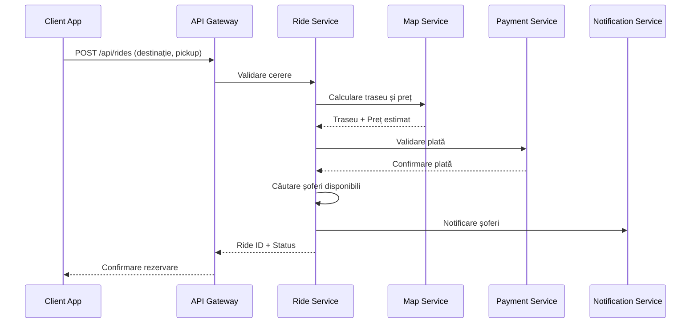
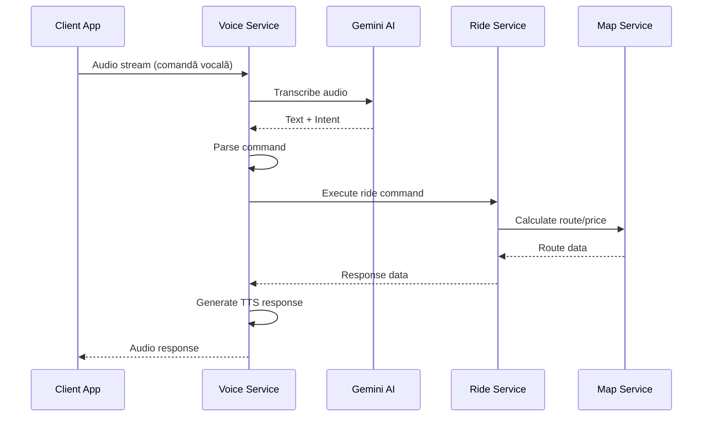

# 🏗️ RAPORT ARHITECTURĂ SERVER-CLIENT FRIENDSRIDE

## 📊 SUMAR EXECUTIV

**Data:** Decembrie 2024  
**Status:** Planificare Arhitectură  
**Scop:** Migrare de la aplicație monolită la arhitectură server-client  
**Beneficii:** Scalabilitate, performanță, securitate, mentenanță  

---

## 🎯 VIZIUNEA ARHITECTURII

### Conceptul "Telecomandă"
Aplicația mobilă devine o **interfață simplă** (telecomandă) care comunică cu un **server centralizat** care gestionează toate operațiunile complexe:

- 🗺️ **Hărți și routing** → Server
- 💰 **Calcule financiare** → Server  
- 👥 **Gestionare utilizatori** → Server
- 🎤 **Procesare AI** → Server
- 📊 **Analitică și raportare** → Server
- 🔒 **Securitate și validare** → Server

---

## 🏛️ ARHITECTURA PROPUȘĂ

### 1. **CLIENT (Aplicația Mobilă)**

#### Responsabilități Client
```typescript
interface ClientResponsibilities {
  // UI/UX
  userInterface: "Renderizare interfață utilizator";
  userInput: "Captare input utilizator (touch, voice, GPS)";
  localCache: "Cache local pentru offline basic";
  
  // Comunicare
  apiCommunication: "Comunicare REST/WebSocket cu server";
  dataSync: "Sincronizare dată cu server";
  
  // Funcționalități locale
  gpsTracking: "Tracking GPS pentru server";
  voiceCapture: "Captare audio pentru procesare server";
  offlineMode: "Mod offline limitat";
}
```

#### Componente Client
```dart
// Structura aplicației client
lib/
├── ui/                    # Doar interfață utilizator
│   ├── screens/          # Ecrane simple
│   ├── widgets/          # Widget-uri UI
│   └── themes/           # Teming și stiluri
├── api/                  # Comunicare cu server
│   ├── client.dart       # HTTP client
│   ├── websocket.dart    # WebSocket pentru real-time
│   └── models/           # Modele de date
├── cache/                # Cache local
│   ├── local_storage.dart
│   └── offline_manager.dart
├── services/             # Servicii locale minime
│   ├── gps_service.dart
│   ├── voice_capture.dart
│   └── notification_service.dart
└── utils/                # Utilitare
```

### 2. **SERVER (Backend Centralizat)**

#### Responsabilități Server
```typescript
interface ServerResponsibilities {
  // Business Logic
  rideMatching: "Algoritm matching șofer-pasager";
  routeCalculation: "Calculare trasee optimizate";
  pricingEngine: "Motor de calcul prețuri";
  
  // AI & Processing
  voiceProcessing: "Procesare comenzi vocale";
  nlpEngine: "Natural Language Processing";
  recommendationEngine: "Recomandări inteligente";
  
  // Data Management
  userManagement: "Gestionare utilizatori și permisiuni";
  rideHistory: "Istoric curse și analitică";
  paymentProcessing: "Procesare plăți";
  
  // Real-time
  realTimeTracking: "Tracking curse în timp real";
  notifications: "Sistem notificări";
  chatSystem: "Chat între utilizatori";
}
```

#### Arhitectura Server
```
┌─────────────────────────────────────────────────────────────┐
│                    FRIENDSRIDE SERVER                      │
├─────────────────────────────────────────────────────────────┤
│  🌐 API Gateway (Kong/Nginx)                              │
│  ├── Authentication & Authorization                        │
│  ├── Rate Limiting                                         │
│  └── Load Balancing                                        │
├─────────────────────────────────────────────────────────────┤
│  🔧 Microservices                                          │
│  ├── 👤 User Service        ├── 🚗 Ride Service           │
│  ├── 🗺️ Map Service         ├── 💰 Payment Service        │
│  ├── 🎤 Voice Service       ├── 📊 Analytics Service      │
│  └── 🔔 Notification Service └── 💬 Chat Service          │
├─────────────────────────────────────────────────────────────┤
│  💾 Data Layer                                             │
│  ├── 🗄️ PostgreSQL (Primary DB)                           │
│  ├── 🔥 Redis (Cache & Sessions)                          │
│  ├── 📁 MongoDB (Documents & Analytics)                   │
│  └── 🗺️ PostGIS (Geospatial Data)                         │
├─────────────────────────────────────────────────────────────┤
│  🤖 AI & ML Services                                       │
│  ├── 🧠 Gemini AI Integration                             │
│  ├── 🎵 Voice Processing (Whisper)                        │
│  ├── 🗺️ Route Optimization                                │
│  └── 📈 Predictive Analytics                              │
├─────────────────────────────────────────────────────────────┤
│  🔌 External Integrations                                  │
│  ├── 🗺️ Mapbox API                                        │
│  ├── 💳 Payment Gateways                                  │
│  ├── 📧 Email Services                                     │
│  └── 📱 Push Notifications                                 │
└─────────────────────────────────────────────────────────────┘
```

---

## 🔄 FLUXUL DE DATE

### 1. **Rezervarea unei Curse (Flux Complet)**



### 2. **Procesarea Comenzilor Vocale**



---

## 🗂️ SERVICII DETALIATE

### 1. **User Service**
```typescript
interface UserService {
  // Authentication
  register(userData: UserRegistration): Promise<User>;
  login(credentials: LoginCredentials): Promise<AuthToken>;
  refreshToken(token: string): Promise<AuthToken>;
  
  // Profile Management
  updateProfile(userId: string, data: ProfileUpdate): Promise<User>;
  uploadAvatar(userId: string, image: Buffer): Promise<string>;
  
  // Driver Management
  becomeDriver(userId: string, documents: DriverDocuments): Promise<Driver>;
  updateDriverStatus(userId: string, status: DriverStatus): Promise<void>;
  
  // Ratings & Reviews
  rateUser(userId: string, rating: Rating): Promise<void>;
  getUserRating(userId: string): Promise<RatingSummary>;
}
```

### 2. **Ride Service**
```typescript
interface RideService {
  // Ride Management
  requestRide(request: RideRequest): Promise<Ride>;
  acceptRide(rideId: string, driverId: string): Promise<Ride>;
  cancelRide(rideId: string, reason: string): Promise<void>;
  completeRide(rideId: string): Promise<RideCompletion>;
  
  // Matching Algorithm
  findNearbyDrivers(pickup: Location, radius: number): Promise<Driver[]>;
  matchDriverToRide(rideId: string): Promise<DriverMatch>;
  
  // Real-time Updates
  updateRideLocation(rideId: string, location: Location): Promise<void>;
  getRideStatus(rideId: string): Promise<RideStatus>;
  
  // History & Analytics
  getRideHistory(userId: string, filters: HistoryFilters): Promise<Ride[]>;
  getRideAnalytics(userId: string, period: TimePeriod): Promise<Analytics>;
}
```

### 3. **Map Service**
```typescript
interface MapService {
  // Route Calculation
  calculateRoute(pickup: Location, destination: Location): Promise<Route>;
  calculateMultipleRoutes(pickup: Location, destinations: Location[]): Promise<Route[]>;
  optimizeRoute(route: Route, preferences: RoutePreferences): Promise<Route>;
  
  // Geocoding
  geocodeAddress(address: string): Promise<Location>;
  reverseGeocode(location: Location): Promise<Address>;
  searchPlaces(query: string, location: Location): Promise<Place[]>;
  
  // Traffic & Real-time
  getTrafficData(route: Route): Promise<TrafficInfo>;
  getETA(route: Route): Promise<number>;
  
  // POI Management
  getNearbyPOIs(location: Location, radius: number): Promise<POI[]>;
  getPOIDetails(poiId: string): Promise<POIDetails>;
}
```

### 4. **Voice Service**
```typescript
interface VoiceService {
  // Speech Processing
  transcribeAudio(audio: Buffer, language: string): Promise<Transcription>;
  synthesizeSpeech(text: string, voice: VoiceConfig): Promise<Buffer>;
  
  // AI Processing
  processVoiceCommand(command: string, context: UserContext): Promise<VoiceResponse>;
  handleConversation(audio: Buffer, sessionId: string): Promise<ConversationResponse>;
  
  // Voice Analytics
  analyzeVoiceQuality(audio: Buffer): Promise<VoiceQuality>;
  detectLanguage(audio: Buffer): Promise<string>;
}
```

### 5. **Payment Service**
```typescript
interface PaymentService {
  // Payment Processing
  processPayment(payment: PaymentRequest): Promise<PaymentResult>;
  refundPayment(rideId: string, amount: number): Promise<RefundResult>;
  
  // Payment Methods
  addPaymentMethod(userId: string, method: PaymentMethod): Promise<void>;
  removePaymentMethod(userId: string, methodId: string): Promise<void>;
  
  // Billing
  generateInvoice(rideId: string): Promise<Invoice>;
  getBillingHistory(userId: string): Promise<BillingRecord[]>;
  
  // Driver Payments
  calculateDriverEarnings(rideId: string): Promise<Earnings>;
  processDriverPayout(driverId: string): Promise<PayoutResult>;
}
```

---

## 📊 TEHNOLOGII ȘI STACK

### Backend Stack
```yaml
# Core Technologies
Runtime: Node.js 18+ / Python 3.11+ / Go 1.21+
Framework: Express.js / FastAPI / Gin
Database: PostgreSQL 15+ with PostGIS
Cache: Redis 7+
Message Queue: RabbitMQ / Apache Kafka

# AI & ML
AI Engine: Google Gemini API
Speech: OpenAI Whisper / Google Speech-to-Text
NLP: spaCy / NLTK / Hugging Face
ML Platform: TensorFlow / PyTorch

# Infrastructure
Containerization: Docker + Kubernetes
API Gateway: Kong / NGINX
Monitoring: Prometheus + Grafana
Logging: ELK Stack (Elasticsearch, Logstash, Kibana)
```

### Frontend Stack (Client)
```yaml
# Mobile App
Framework: Flutter 3.16+
Language: Dart 3.2+
State Management: Provider / Riverpod
HTTP Client: Dio
WebSocket: WebSocket

# Caching
Local Storage: Hive / SQLite
Image Caching: Cached Network Image
API Caching: Dio Cache Interceptor
```

---

## 🔒 SECURITATE ȘI AUTENTIFICARE

### Autentificare
```typescript
// JWT-based Authentication
interface AuthSystem {
  // Token Management
  accessToken: "JWT cu expirare scurtă (15 min)";
  refreshToken: "JWT cu expirare lungă (7 zile)";
  deviceToken: "Token unic per dispozitiv";
  
  // Security Features
  rateLimiting: "Rate limiting per utilizator/IP";
  deviceBinding: "Legare token la dispozitiv specific";
  biometricAuth: "Autentificare biometrică locală";
  twoFactorAuth: "2FA pentru operațiuni sensibile";
}
```

### Securitatea Datelor
```typescript
interface DataSecurity {
  // Encryption
  dataAtRest: "AES-256 encryption pentru date stocate";
  dataInTransit: "TLS 1.3 pentru comunicare";
  apiKeys: "Rotire automată chei API";
  
  // Privacy
  gdprCompliance: "Conformitate GDPR completă";
  dataAnonymization: "Anonimizare date pentru analitică";
  userConsent: "Gestionare consimțământ utilizator";
  dataRetention: "Politici de păstrare date";
}
```

---

## 📈 SCALABILITATE ȘI PERFORMANȚĂ

### Strategii de Scalare
```yaml
# Horizontal Scaling
Load Balancers: "NGINX + HAProxy pentru distribuire trafic"
Database Sharding: "Sharding pe regiuni geografice"
Microservices: "Servicii independente scalabile"
CDN: "CloudFlare/AWS CloudFront pentru assets statice"

# Caching Strategy
Redis Clusters: "Cache distribuit pentru sesiuni și date frecvente"
Database Read Replicas: "Replica-uri pentru query-uri de citire"
API Response Caching: "Cache pentru răspunsuri API statice"
Client-side Caching: "Cache local pentru date offline"

# Performance Optimization
Database Indexing: "Indexuri optimizate pentru query-uri frecvente"
Connection Pooling: "Pool-uri de conexiuni pentru baze de date"
Async Processing: "Procesare asincronă pentru operațiuni grele"
Background Jobs: "Job-uri în background pentru task-uri non-critice"
```

### Metrici de Performanță
```typescript
interface PerformanceMetrics {
  // API Performance
  responseTime: "P95 < 200ms pentru API-uri critice";
  throughput: "10,000+ requests/sec per service";
  errorRate: "< 0.1% error rate";
  
  // Database Performance
  queryTime: "P95 < 50ms pentru query-uri simple";
  connectionPool: "95%+ connection pool utilization";
  cacheHitRate: "80%+ cache hit rate";
  
  // Real-time Performance
  websocketLatency: "< 50ms pentru mesaje real-time";
  gpsUpdateFrequency: "1 update/sec în timpul cursei";
  voiceProcessingTime: "< 500ms pentru procesare vocală";
}
```

---

## 🚀 PLANUL DE MIGRARE

### Faza 1: Preparare (2-3 săptămâni)
```yaml
Tasks:
  - Setup infrastructure (servers, databases)
  - Implementare API Gateway
  - Setup CI/CD pipeline
  - Implementare servicii de bază (User, Auth)
  - Testing framework setup

Deliverables:
  - Infrastructure ready
  - Basic API endpoints
  - Authentication system
  - Development environment
```

### Faza 2: Migrare Servicii Core (4-5 săptămâni)
```yaml
Tasks:
  - Implementare Ride Service
  - Implementare Map Service
  - Migrare logica de business
  - Implementare Payment Service
  - Setup monitoring și logging

Deliverables:
  - Core services functional
  - Business logic migrated
  - Payment processing ready
  - Monitoring dashboard
```

### Faza 3: Migrare AI și Real-time (3-4 săptămâni)
```yaml
Tasks:
  - Implementare Voice Service
  - Migrare AI processing
  - Implementare WebSocket pentru real-time
  - Setup notification system
  - Performance optimization

Deliverables:
  - AI services migrated
  - Real-time communication
  - Notification system
  - Performance optimized
```

### Faza 4: Client Migration (2-3 săptămâni)
```yaml
Tasks:
  - Refactor client app
  - Implementare API communication
  - Setup offline capabilities
  - Testing și debugging
  - Performance optimization

Deliverables:
  - Client app refactored
  - API integration complete
  - Offline mode working
  - Performance optimized
```

### Faza 5: Testing și Deployment (2-3 săptămâni)
```yaml
Tasks:
  - Integration testing
  - Load testing
  - Security testing
  - Beta testing cu utilizatori
  - Production deployment

Deliverables:
  - Full system tested
  - Security validated
  - Beta feedback integrated
  - Production ready
```

---

## 💰 ANALIZA COSTURILOR

### Costuri Infrastructură (Lunar)
```yaml
# Cloud Infrastructure (AWS/GCP/Azure)
Compute: "$2,000 - $5,000 (scalabil)"
Database: "$500 - $1,500 (PostgreSQL + Redis)"
Storage: "$200 - $800 (S3/Cloud Storage)"
CDN: "$100 - $400 (CloudFlare/AWS CloudFront)"
Monitoring: "$200 - $600 (DataDog/New Relic)"

# External Services
Mapbox API: "$500 - $2,000 (depinde de utilizare)"
Gemini AI: "$300 - $1,200 (depinde de volum)"
Payment Processing: "2.9% + $0.30 per tranzacție"
SMS/Email: "$100 - $500 (Twilio/SendGrid)"

# Total Estimated: $4,000 - $12,000/lună
```

### Beneficii Financiare
```yaml
# Cost Savings
Development Time: "50% reducere timp dezvoltare"
Maintenance: "70% reducere costuri mentenanță"
Scaling: "80% reducere costuri scaling manual"
Security: "90% reducere riscuri securitate"

# Revenue Opportunities
New Features: "Implementare rapidă funcționalități noi"
Market Expansion: "Scalare rapidă în noi piețe"
Data Monetization: "Analitică și insights pentru business"
API Monetization: "Vânzare API către terți"
```

---

## 🎯 RECOMANDĂRI FINALE

### 1. **Implementare Graduală**
- Începe cu serviciile critice (User, Ride, Payment)
- Migrează funcționalitățile una câte una
- Menține aplicația actuală funcțională în timpul migrării
- Folosește feature flags pentru controlul implementării

### 2. **Prioritizare Servicii**
```yaml
Priority 1 (Critical):
  - User Service (autentificare, profil)
  - Ride Service (business logic core)
  - Payment Service (plăți)

Priority 2 (Important):
  - Map Service (routing, geocoding)
  - Notification Service (notificări)

Priority 3 (Nice to have):
  - Voice Service (AI processing)
  - Analytics Service (raportare)
```

### 3. **Strategia de Testing**
- Implementează testing automat pentru toate serviciile
- Folosește contract testing pentru API-uri
- Setup staging environment identic cu production
- Implementează canary deployments

### 4. **Monitorizare și Observabilitate**
- Setup monitoring complet (metrics, logs, traces)
- Implementează alerting pentru probleme critice
- Dashboard-uri pentru business metrics
- Automated incident response

### 5. **Securitate și Compliance**
- Security-first approach pentru toate serviciile
- Regular security audits și penetration testing
- GDPR compliance din prima zi
- Data encryption at rest și in transit

---

## 📋 CONCLUZIE

Migrarea la o arhitectură server-client va transforma FriendsRide dintr-o aplicație monolită într-o platformă scalabilă, sigură și performantă. Aplicația mobilă va deveni o interfață simplă (telecomandă) care comunică cu un backend robust care gestionează toate operațiunile complexe.

**Beneficiile cheie:**
- 🚀 **Scalabilitate** - Sistem poate gestiona milioane de utilizatori
- 🔒 **Securitate** - Securitate centralizată și auditabilă
- ⚡ **Performanță** - Optimizări specifice pentru fiecare serviciu
- 🛠️ **Mentenanță** - Dezvoltare și mentenanță mai ușoară
- 💰 **Costuri** - Optimizare costuri prin scalare automată

**Următorul pas:** Începe cu implementarea infrastructurii de bază și migrarea primului serviciu (User Service) pentru a valida arhitectura propusă.
